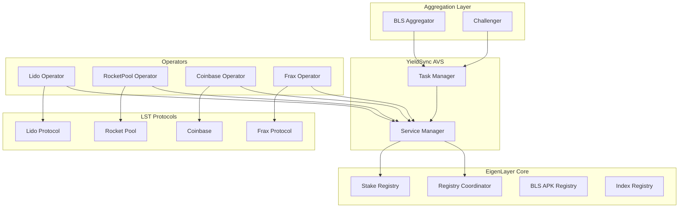
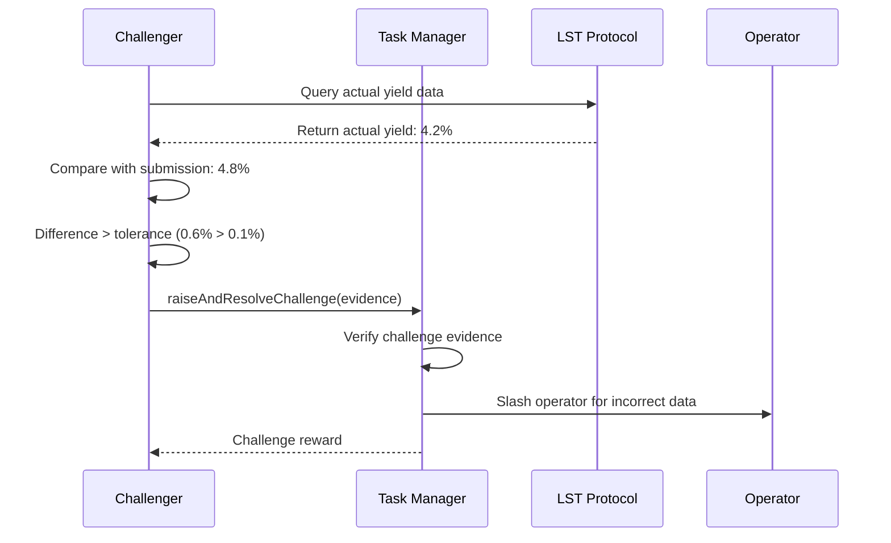

# YieldSync AVS Integration Guide

[](https://eigenlayer.xyz/)
[](https://golang.org/)
[](https://www.typescriptlang.org/)

Complete guide for integrating with the YieldSync EigenLayer AVS, including operator setup, aggregator deployment, and challenger configuration.

---

## 🏗️ AVS Architecture Overview

### Component Architecture



### Service Manager Implementation

The YieldSync Service Manager extends EigenLayer's `ServiceManagerBase`:

```solidity
contract YieldSyncServiceManager is ServiceManagerBase {
    using BN254 for BN254.G1Point;
    
    struct LSTYieldData {
        address lstToken;
        uint256 currentYieldRate;      // Annual yield rate (basis points)
        uint256 lastUpdateTimestamp;
        uint256 validatorCount;        // Operators confirming this data
        bytes32 dataHash;
    }
    
    mapping(address => LSTYieldData) public lstYieldData;
    mapping(uint256 => YieldAdjustmentTask) public adjustmentTasks;
    
    // Core AVS functions
    function submitYieldData(address lstToken, uint256 yieldRate, bytes calldata proof) external;
    function getRequiredAdjustment(address lstToken, uint256 lastAdjustment) external view returns (uint256);
    function createYieldTask(address lstToken, uint256 expectedYield) external;
}
```

---

## 🔧 Operator Setup

### Prerequisites

```bash
# System requirements
go version    # Go 1.21+
node --version # Node 18+
docker --version # Docker 20+

# Install dependencies
npm install -g typescript ts-node
```

### Operator Registration

```bash
# 1. Generate operator keys
eigenlayer operator keys create --key-type ecdsa your-operator-name
eigenlayer operator keys create --key-type bls your-operator-name

# 2. Register with EigenLayer
eigenlayer operator register operator.yaml

# 3. Register with YieldSync AVS
eigenlayer operator register-with-avs avs-config.yaml
```

### Configuration Files

#### `operator.yaml`
```yaml
# EigenLayer Operator Configuration
operator:
  address: "0x..." # Your operator address
  earnings_receiver_address: "0x..." # Earnings recipient
  delegation_approver_address: "0x000..." # Set to zero address if no delegation approver
  staker_opt_out_window_blocks: 50400 # ~7 days on mainnet
  metadata_url: "https://your-domain.com/metadata.json"

# Keys
private_key_store_path: /path/to/key/store
signer_type: local_keystore

# RPC Configuration  
eth_rpc_url: https://mainnet.infura.io/v3/YOUR_KEY
eth_ws_url: wss://mainnet.infura.io/ws/v3/YOUR_KEY

# Network
chain_id: 1 # Mainnet
```

#### `avs-config.yaml`
```yaml
# YieldSync AVS Configuration
avs:
  service_manager_address: "0x..." # YieldSync Service Manager
  registry_coordinator_address: "0x..." # Registry Coordinator
  
# Monitoring Configuration
monitoring:
  lido_enabled: true
  rocketpool_enabled: true  
  coinbase_enabled: true
  frax_enabled: true
  update_interval: "15m"
  
# API Keys (required for protocol integration)
api_keys:
  lido_api_key: "your_lido_key"
  coinbase_api_key: "your_coinbase_key"
  # Note: Rocket Pool and Frax use public APIs

# Performance
batch_size: 10
max_concurrent_requests: 5
```

### LST Protocol Integration

#### Lido Integration
```typescript
// avs/operator/core/lido_monitor.ts
export class LidoMonitor implements LSTMonitor {
    private readonly API_BASE = 'https://api.lido.fi/v1';
    
    async getCurrentYield(): Promise<YieldData> {
        // Fetch consensus layer data
        const rewards = await this.fetchConsensusRewards();
        const totalSupply = await this.fetchStETHSupply();
        
        // Calculate APR
        const dailyRewards = rewards.daily_rewards;
        const annualYield = (dailyRewards * 365) / totalSupply;
        
        return {
            lstToken: LIDO_STETH_ADDRESS,
            yieldRate: Math.floor(annualYield * 10000), // Convert to basis points
            timestamp: Date.now(),
            source: 'lido_consensus_layer'
        };
    }
    
    private async fetchConsensusRewards(): Promise<ConsensusRewards> {
        const response = await fetch(`${this.API_BASE}/rewards/consensus`);
        return response.json();
    }
}
```

#### Rocket Pool Integration
```typescript
// avs/operator/core/rocketpool_monitor.ts
export class RocketPoolMonitor implements LSTMonitor {
    private readonly RPC_URL: string;
    
    async getCurrentYield(): Promise<YieldData> {
        // Query rETH exchange rate directly from contract
        const rethContract = new ethers.Contract(RETH_ADDRESS, RETH_ABI, this.provider);
        const currentRate = await rethContract.getExchangeRate();
        
        // Calculate yield from rate change over time
        const historicalRate = await this.getHistoricalRate(30); // 30 days ago
        const rateChange = (currentRate - historicalRate) / historicalRate;
        const annualYield = (rateChange * 365) / 30; // Annualize
        
        return {
            lstToken: RETH_ADDRESS,
            yieldRate: Math.floor(annualYield * 10000),
            timestamp: Date.now(),
            source: 'rocketpool_exchange_rate'
        };
    }
}
```

### Operator Deployment

```bash
# 1. Build operator
cd avs/operator
npm run build

# 2. Start operator
npm run start:mainnet

# 3. Verify registration
curl http://localhost:8080/health
curl http://localhost:8080/status
```

---

## 📡 Aggregator Setup

### BLS Signature Aggregation

```typescript
// avs/aggregator/core/bls_aggregator.ts
export class BLSAggregator {
    private operators: Map<string, OperatorInfo> = new Map();
    
    async aggregateYieldSubmissions(lstToken: string): Promise<AggregatedYield> {
        const submissions = await this.collectSubmissions(lstToken);
        
        // Verify each operator signature
        const validSubmissions = await Promise.all(
            submissions.map(async (sub) => {
                const isValid = await this.verifyBLSSignature(sub);
                return isValid ? sub : null;
            })
        );
        
        const filtered = validSubmissions.filter(Boolean);
        
        // Check for consensus (67% agreement)
        const consensusYield = this.calculateConsensus(filtered);
        if (!consensusYield) {
            throw new Error('No consensus reached on yield data');
        }
        
        // Aggregate BLS signatures
        const aggregatedSignature = this.aggregateSignatures(filtered);
        
        return {
            lstToken,
            consensusYield: consensusYield.yieldRate,
            operatorCount: filtered.length,
            aggregatedSignature,
            timestamp: Date.now()
        };
    }
    
    private calculateConsensus(submissions: YieldSubmission[]): YieldData | null {
        // Group submissions by yield rate (with tolerance)
        const groups = this.groupByYield(submissions, 5); // 5 basis points tolerance
        
        // Find largest group
        let largestGroup = [];
        for (const group of groups) {
            if (group.length > largestGroup.length) {
                largestGroup = group;
            }
        }
        
        // Check if largest group has >67% of submissions
        const consensusThreshold = Math.ceil(submissions.length * 0.67);
        if (largestGroup.length >= consensusThreshold) {
            return this.averageYield(largestGroup);
        }
        
        return null;
    }
}
```

### Aggregator Deployment

```bash
# 1. Configure aggregator
cd avs/aggregator
cp config-files/aggregator.mainnet.yaml config.yaml

# 2. Build and start
npm run build
npm run start:mainnet

# 3. Monitor aggregation
curl http://localhost:8081/metrics
curl http://localhost:8081/consensus/stETH
```

---

## 🛡️ Challenger Implementation

### Fraud Proof System

```typescript
// avs/challenger/core/yield_validator.ts
export class YieldValidator {
    async validateYieldSubmission(submission: YieldSubmission): Promise<ValidationResult> {
        try {
            // 1. Verify yield data against source protocol
            const actualYield = await this.fetchActualYield(submission.lstToken);
            const submittedYield = submission.yieldRate;
            
            // 2. Check tolerance (allow 10 basis points difference)
            const tolerance = 10; // basis points
            const difference = Math.abs(actualYield - submittedYield);
            
            if (difference > tolerance) {
                // 3. Submit challenge
                await this.submitChallenge(submission, {
                    actualYield,
                    submittedYield,
                    difference,
                    evidence: await this.gatherEvidence(submission.lstToken)
                });
                
                return {
                    isValid: false,
                    reason: 'YIELD_MISMATCH',
                    difference
                };
            }
            
            return {
                isValid: true,
                difference
            };
            
        } catch (error) {
            return {
                isValid: false,
                reason: 'VALIDATION_ERROR',
                error: error.message
            };
        }
    }
    
    private async submitChallenge(submission: YieldSubmission, evidence: Evidence): Promise<void> {
        const taskManager = new ethers.Contract(TASK_MANAGER_ADDRESS, TASK_MANAGER_ABI, this.signer);
        
        await taskManager.raiseAndResolveChallenge(
            submission.taskId,
            submission.yieldRate,
            evidence.proof,
            { gasLimit: 500000 }
        );
    }
}
```

### Challenge Process



---

## 🔐 Security & Economics

### Economic Security Model

#### Operator Rewards
- **Base Reward**: 0.001 ETH per valid yield update
- **Accuracy Bonus**: 20% bonus for >99% accuracy over 30 days
- **Consensus Bonus**: 10% bonus for contributing to consensus

#### Slashing Conditions
- **Incorrect Data**: 1% of stake slashed for yield data >1% off
- **Unavailability**: 0.1% slashed for missing >5% of tasks in 24h period
- **Malicious Behavior**: Up to 5% slashed for provable malicious actions

#### Challenge Economics
- **Challenge Bond**: 0.1 ETH required to submit challenge
- **Challenge Reward**: 50% of slashed amount to successful challenger
- **False Challenge**: Challenger loses bond for invalid challenges

### Security Considerations

1. **Operator Key Management**
   ```bash
   # Use hardware security modules in production
   # Separate signing keys from operational keys
   # Regular key rotation (monthly recommended)
   ```

2. **Network Security**
   ```yaml
   # Use VPN or private networks
   # Firewall configuration
   # DDoS protection
   # Rate limiting on APIs
   ```

3. **Data Validation**
   ```typescript
   // Multi-source validation
   // Cross-reference with multiple APIs
   // Historical data consistency checks
   // Outlier detection
   ```

---

## 📊 Monitoring & Metrics

### Operator Metrics

```typescript
// avs/operator/metrics/collector.ts
export class MetricsCollector {
    private prometheus = require('prom-client');
    
    // Metrics definitions
    private yieldSubmissions = new this.prometheus.Counter({
        name: 'yieldsync_yield_submissions_total',
        help: 'Total yield data submissions',
        labelNames: ['lst_token', 'status']
    });
    
    private yieldAccuracy = new this.prometheus.Histogram({
        name: 'yieldsync_yield_accuracy',
        help: 'Yield data accuracy percentage',
        buckets: [90, 95, 98, 99, 99.5, 99.9, 100]
    });
    
    recordYieldSubmission(lstToken: string, accuracy: number, status: 'success' | 'failure') {
        this.yieldSubmissions.inc({ lst_token: lstToken, status });
        this.yieldAccuracy.observe(accuracy);
    }
}
```

### Monitoring Dashboard

```bash
# Prometheus + Grafana setup
docker-compose up -d prometheus grafana

# Access dashboards
# Grafana: http://localhost:3000
# Prometheus: http://localhost:9090
```

### Key Metrics to Monitor

1. **Operator Health**
   - Yield submission frequency
   - Data accuracy percentage
   - Consensus participation rate
   - Slash events

2. **Network Health**
   - Total active operators
   - Consensus success rate
   - Average response time
   - Challenge frequency

3. **Protocol Integration**
   - API response times
   - Data freshness
   - Error rates by protocol

---

## 🚀 Production Deployment

### Deployment Checklist

- [ ] **Keys Generated**: ECDSA and BLS keys created securely
- [ ] **Registration**: Registered with EigenLayer and AVS
- [ ] **Configuration**: All config files properly set
- [ ] **API Keys**: LST protocol API keys configured
- [ ] **Infrastructure**: Monitoring and alerting set up
- [ ] **Testing**: Operator tested on testnet
- [ ] **Backup**: Key backup and recovery procedures in place

### Mainnet Deployment

```bash
# 1. Final configuration check
./scripts/validate-config.sh

# 2. Deploy to mainnet
npm run deploy:mainnet

# 3. Start monitoring
npm run monitor:start

# 4. Verify operation
curl https://your-operator.com/health
curl https://your-operator.com/metrics
```

### Post-Deployment

1. **Monitor Performance**: Track accuracy and uptime
2. **Update Configurations**: Adjust parameters based on performance
3. **Security Review**: Regular security audits and updates
4. **Community Participation**: Engage with operator community

---

## 📚 API Reference

### Operator API Endpoints

```typescript
// Health check
GET /health
Response: { status: "healthy", uptime: 3600, version: "1.0.0" }

// Metrics
GET /metrics
Response: Prometheus metrics format

// Yield data
GET /yield/:lstToken
Response: { yieldRate: 420, timestamp: 1640995200, accuracy: 99.8 }

// Status
GET /status
Response: { 
  registered: true, 
  stake: "32000000000000000000", 
  quorums: [0, 1],
  lastSubmission: 1640995200
}
```

### Task Manager Interface

```solidity
interface IYieldSyncTaskManager {
    function createNewTask(address lstToken, uint256 expectedYield) external;
    function respondToTask(uint256 taskId, uint256 yieldRate, bytes calldata signature) external;
    function raiseAndResolveChallenge(uint256 taskId, bytes calldata evidence) external;
}
```

---

## 🔧 Troubleshooting

### Common Issues

1. **Registration Failed**
   ```bash
   # Check operator registration
   eigenlayer operator status
   
   # Verify configuration
   eigenlayer operator config validate
   ```

2. **Signature Verification Failed**
   ```bash
   # Check BLS key
   eigenlayer operator keys list --key-type bls
   
   # Regenerate if needed
   eigenlayer operator keys create --key-type bls your-operator-name --rebuild
   ```

3. **API Connection Issues**
   ```bash
   # Test LST protocol APIs
   curl -H "Authorization: Bearer $API_KEY" https://api.lido.fi/v1/rewards
   
   # Check network connectivity
   telnet api.lido.fi 443
   ```

### Debug Mode

```bash
# Enable debug logging
export LOG_LEVEL=debug

# Run with detailed logging
npm run start:debug

# Check logs
tail -f logs/operator.log
```

---

## 📖 Further Resources

- [EigenLayer AVS Developer Guide](https://docs.eigenlayer.xyz/eigenlayer/avs-guides/avs-developer-guide)
- [BLS Signature Aggregation](https://docs.eigenlayer.xyz/eigenlayer/avs-guides/incredible-squaring-avs#bls-signature-aggregation)  
- [LST Protocol APIs](LST_PROTOCOLS.md)
- [Deployment Guide](DEPLOYMENT_GUIDE.md)

---

*Built with ❤️ for the EigenLayer ecosystem. Securing DeFi through decentralized validation.*