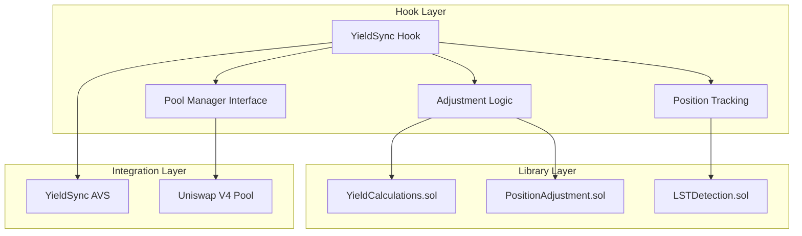
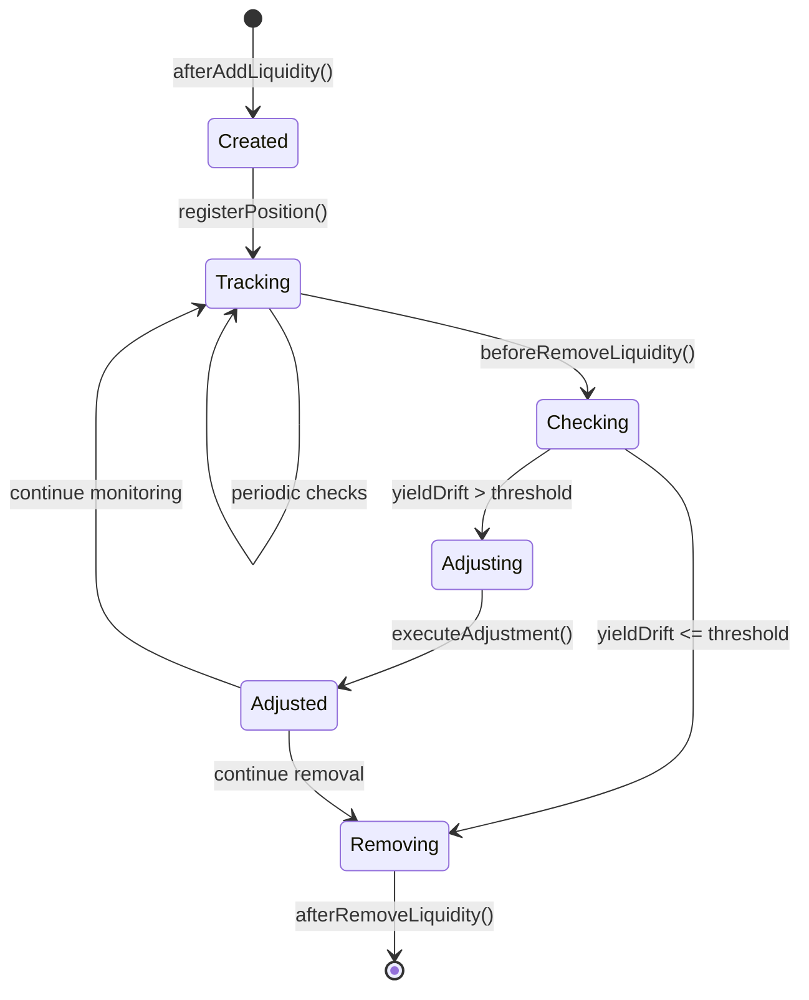

# YieldSync Hook Architecture Guide

[](https://soliditylang.org/)
[](https://uniswap.org/)
[](https://forge.sh/)

Comprehensive guide to YieldSync Hook's architecture, implementation patterns, and integration with Uniswap V4.

---

## 🏗️ Core Architecture

### Hook System Overview

YieldSync Hook implements the Uniswap V4 hook pattern to provide automatic position adjustment for LST pools. The architecture consists of three main layers:



### Contract Structure

```solidity
contract YieldSyncHook is BaseHook {
    // State Management
    mapping(bytes32 => LPPositionData) public positions;
    mapping(PoolId => PoolLSTConfig) public poolConfigs;
    mapping(address => uint256) public totalILPrevented;
    
    // Core Hook Functions
    function afterInitialize(...) external override returns (bytes4);
    function afterAddLiquidity(...) external override returns (bytes4, BalanceDelta);
    function beforeRemoveLiquidity(...) external override returns (bytes4);
    
    // Position Management
    function _checkAndAdjustPosition(bytes32 positionId) internal;
    function _executePositionAdjustment(bytes32 positionId, uint256 yieldBPS) internal;
    function _calculateAdjustedTicks(...) internal pure returns (int24, int24);
    
    // AVS Integration
    IYieldSyncAVS public immutable yieldSyncAVS;
}
```

---

## 🎣 Hook Permission System

### Hook Permissions

YieldSync Hook uses specific hook permissions to optimize gas and functionality:

```solidity
function getHookPermissions() public pure override returns (Hooks.Permissions memory) {
    return Hooks.Permissions({
        beforeInitialize: false,        // Not needed - pool setup is standard
        afterInitialize: true,          // ✓ Configure LST pools and detection
        beforeAddLiquidity: false,      // Not needed - standard liquidity addition
        afterAddLiquidity: true,        // ✓ Register and track new positions
        beforeRemoveLiquidity: true,    // ✓ Check for yield adjustment before removal
        afterRemoveLiquidity: true,     // ✓ Clean up position tracking
        beforeSwap: false,              // Not needed - swaps don't affect positions
        afterSwap: false,               // Not needed - swaps don't affect positions
        beforeDonate: false,            // Not needed - donations don't affect positions
        afterDonate: false,             // Not needed - donations don't affect positions
        beforeSwapReturnDelta: false,   // Not using delta modification
        afterSwapReturnDelta: false,    // Not using delta modification
        afterAddLiquidityReturnDelta: false,    // Not modifying liquidity deltas
        afterRemoveLiquidityReturnDelta: false  // Not modifying liquidity deltas
    });
}
```

### Permission Rationale

1. **afterInitialize**: Configure LST detection and pool setup
2. **afterAddLiquidity**: Register positions for yield tracking
3. **beforeRemoveLiquidity**: Last chance to adjust position before removal
4. **afterRemoveLiquidity**: Clean up tracking data

---

## 🔍 LST Detection System

### Auto-Detection Logic

```solidity
function _detectLSTInPool(PoolKey calldata key) internal pure returns (
    bool hasLST,
    address lstToken,
    address pairedToken,
    bool isLSTToken0
) {
    address token0 = address(key.currency0);
    address token1 = address(key.currency1);
    
    // Check token0 for LST
    if (_isLST(token0)) {
        return (true, token0, token1, true);
    }
    
    // Check token1 for LST
    if (_isLST(token1)) {
        return (true, token1, token0, false);
    }
    
    return (false, address(0), address(0), false);
}

function _isLST(address token) internal pure returns (bool) {
    return token == 0xae7ab96520DE3A18E5e111B5EaAb095312D7fE84 || // stETH
           token == 0xae78736Cd615f374D3085123A210448E74Fc6393 || // rETH
           token == 0xBe9895146f7AF43049ca1c1AE358B0541Ea49704 || // cbETH
           token == 0xac3E018457B222d93114458476f3E3416Abbe38F;   // sfrxETH
}
```

### Supported LST Tokens

| Token | Address | Protocol | Yield Mechanism |
|-------|---------|----------|----------------|
| stETH | 0xae7ab...7fE84 | Lido | Consensus layer rewards |
| rETH  | 0xae787...6393 | Rocket Pool | Exchange rate appreciation |
| cbETH | 0xBe989...6704 | Coinbase | Institutional staking |
| sfrxETH | 0xac3E0...Abbe38F | Frax | Frax validator rewards |

---

## 📊 Position Management

### Position Data Structure

```solidity
struct LPPositionData {
    address owner;                   // Position owner
    PoolId poolId;                   // Pool identifier
    int24 tickLower;                 // Lower tick bound
    int24 tickUpper;                 // Upper tick bound
    uint128 liquidity;               // Position liquidity
    address lstToken;                // Associated LST token
    uint256 lastYieldAdjustment;     // Last adjustment timestamp
    uint256 accumulatedYieldBPS;     // Total yield accumulated (basis points)
    bool autoAdjustEnabled;          // Auto-adjustment setting
}

struct PoolLSTConfig {
    address lstToken;                // LST in this pool
    address pairedToken;             // Paired token (ETH, USDC, etc.)
    bool isLSTToken0;                // True if LST is token0
    uint256 adjustmentThresholdBPS;  // Minimum yield to trigger adjustment
    bool autoAdjustmentEnabled;      // Pool-level auto-adjustment
}
```

### Position Lifecycle



---

## ⚙️ Yield Adjustment Algorithm

### Adjustment Calculation

```solidity
function _calculateAdjustedTicks(
    int24 currentTickLower,
    int24 currentTickUpper,
    uint256 yieldBPS,
    bool isLSTToken0
) internal pure returns (int24 newTickLower, int24 newTickUpper) {
    // Convert yield BPS to tick adjustment
    // Formula: tickShift = yieldBPS * TICK_MULTIPLIER / BASIS_POINTS
    int24 tickShift = int24(int256(yieldBPS * 4)); // 4 ticks per basis point
    
    if (isLSTToken0) {
        // LST is token0: LST appreciating means price ratio increases
        // Shift range UP to follow the appreciation
        newTickLower = currentTickLower + tickShift;
        newTickUpper = currentTickUpper + tickShift;
    } else {
        // LST is token1: LST appreciating means price ratio decreases  
        // Shift range DOWN to follow the appreciation
        newTickLower = currentTickLower - tickShift;
        newTickUpper = currentTickUpper - tickShift;
    }
}
```

### Adjustment Triggers

1. **Time-based**: Minimum 6 hours between adjustments (ADJUSTMENT_COOLDOWN)
2. **Threshold-based**: Minimum 0.5% yield accumulation (adjustmentThresholdBPS)
3. **Event-triggered**: Any position interaction (modify, remove)

### Gas Optimization

- **Batched adjustments**: Multiple positions adjusted in single transaction
- **Lazy evaluation**: Adjustments only calculated when positions are accessed
- **Efficient storage**: Packed structs and minimal state changes

---

## 🔗 AVS Integration

### AVS Query Interface

```solidity
interface IYieldSyncAVS {
    function getRequiredAdjustment(
        address lstToken,
        uint256 lastAdjustmentTimestamp
    ) external view returns (uint256 adjustmentBPS);
    
    function getYieldData(address lstToken) 
        external view returns (uint256 currentYield, uint256 lastUpdate);
}
```

### Integration Flow

```solidity
function _checkAndAdjustPosition(bytes32 positionId) internal {
    LPPositionData storage position = positions[positionId];
    if (position.owner == address(0) || !position.autoAdjustEnabled) return;
    
    // Query AVS for yield data
    uint256 requiredAdjustmentBPS = yieldSyncAVS.getRequiredAdjustment(
        position.lstToken,
        position.lastYieldAdjustment
    );
    
    PoolLSTConfig memory config = poolConfigs[position.poolId];
    
    // Check adjustment criteria
    if (requiredAdjustmentBPS >= config.adjustmentThresholdBPS &&
        block.timestamp >= position.lastYieldAdjustment + ADJUSTMENT_COOLDOWN) {
        
        _executePositionAdjustment(positionId, requiredAdjustmentBPS);
    }
}
```

---

## 🧪 Testing Architecture

### Test Categories

1. **Unit Tests**: Individual function testing
2. **Integration Tests**: Hook + Pool interactions
3. **Fuzz Tests**: Property-based testing with randomized inputs
4. **E2E Tests**: Complete user journey testing

### Key Test Patterns

```solidity
// Position adjustment testing
function testPositionAdjustment() public {
    // Setup: Create position with stETH-ETH
    // Action: Simulate yield accumulation
    // Assert: Position ticks adjusted correctly
}

// LST detection testing  
function testLSTDetection() public {
    // Test all supported LST tokens
    // Test unsupported tokens return false
    // Test edge cases (zero addresses, etc.)
}

// Gas optimization testing
function testGasUsage() public {
    // Measure gas usage for typical operations
    // Compare against benchmarks
    // Ensure optimizations maintain correctness
}
```

### Fuzz Testing Properties

1. **Position Integrity**: Position data remains consistent after adjustments
2. **Yield Calculation**: Yield calculations never overflow or underflow
3. **Tick Boundaries**: Adjusted ticks remain within valid ranges
4. **Permission Safety**: Only position owners can modify positions

---

## 🔒 Security Considerations

### Access Control

- **Position Ownership**: Only position owners can modify auto-adjustment settings
- **Hook Permissions**: Hook only activated for supported operations
- **AVS Trust**: AVS data validation and consensus verification

### Safety Checks

```solidity
// Position validation
require(position.owner == msg.sender, "Not position owner");
require(position.liquidity > 0, "Invalid position");

// Tick validation
require(newTickLower < newTickUpper, "Invalid tick range");
require(newTickLower >= MIN_TICK && newTickUpper <= MAX_TICK, "Tick out of bounds");

// Yield validation
require(yieldBPS <= MAX_YIELD_BPS, "Yield too high");
require(block.timestamp >= lastAdjustment + COOLDOWN, "Too frequent adjustments");
```

### Emergency Features

1. **Position Disable**: Users can disable auto-adjustment anytime
2. **Manual Override**: Manual position adjustment available
3. **Circuit Breaker**: Maximum adjustment limits prevent extreme changes

---

## 📈 Performance Optimizations

### Gas Optimizations

1. **Packed Structs**: Efficient storage layout
2. **Minimal State**: Only essential data stored on-chain
3. **Batch Operations**: Multiple positions processed together
4. **Lazy Computation**: Calculations only when needed

### Capital Efficiency

1. **Precise Adjustments**: Sub-tick precision for optimal positioning
2. **Yield-Aware Ranges**: Positions sized for expected yield drift
3. **IL Prevention**: Proactive adjustment reduces impermanent loss
4. **Fee Optimization**: Positions maintained in active trading ranges

---

## 🔧 Development Tools

### Local Development

```bash
# Start local environment
forge test --match-contract YieldSyncHookTest

# Gas profiling
forge test --gas-report

# Coverage analysis
forge coverage --report lcov
```

### Deployment

```bash
# Local deployment (Anvil)
forge script script/DeployAnvil.s.sol --fork-url http://localhost:8545 --broadcast

# Testnet deployment
forge script script/DeployTestnet.s.sol --rpc-url $HOLESKY_RPC_URL --broadcast --verify

# Mainnet deployment
forge script script/DeployMainnet.s.sol --rpc-url $MAINNET_RPC_URL --broadcast --verify
```

---

## 📚 Further Reading

- [Uniswap V4 Hook Development Guide](https://docs.uniswap.org/contracts/v4/overview)
- [EigenLayer AVS Integration](../EIGENLAYER_IMPLEMENTATION.md)
- [LST Protocol Documentation](../LST_PROTOCOLS.md)
- [Deployment Guide](../DEPLOYMENT_GUIDE.md)

---

*Built with ❤️ for the Uniswap V4 and LST ecosystem. Enabling intelligent yield-aware liquidity management.*